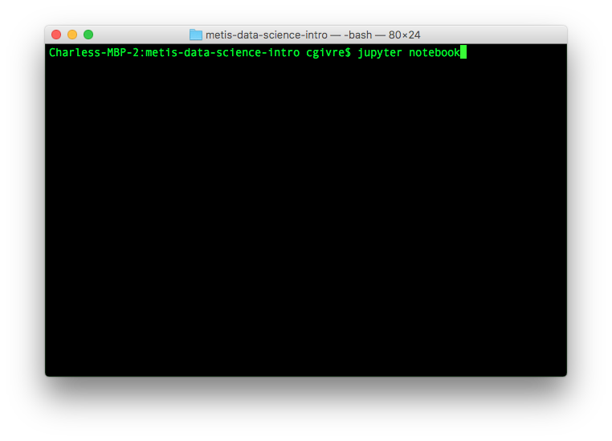

# Intro to Data Science Using Python with Charles Givre 
## Let's set up your computer!
### Step 1: Install Anaconda.
Anaconda from Continuum Analytics provides virtually everything you need to get started in data science. Go to https://continuum.io/downloads and follow the instructions in the website - they vary per platform.
**Please install the version for Python 3.** 
### Step 2: Install Git (optional)
You'll need a command line prompt to launch Anaconda's Jupyter Notebooks for this lesson. We recommend Git in case you're interested in version control or cloud deployment in the future. Go to http://git-scm.com/downloads and follow the directions there.
### Step 3: Starting Jupyter Notebook
We're going to use Jupyter, formerly known as IPython, which is short for “Interactive Python.” This is a way for you to code within a browser in a faster, interactive way.
* Open your terminal prompt and type `git clone https://github.com/cgivre/metis-data-science-intro`.  This will copy the contents of this repository onto your machine.
* Navigate to your working directory
* Type `jupyter notebook` into the prompt and some computation should happen.

* Go to your browser and type in this URL: http://localhost:8888/ (this may launch anyway)
If you see a new browser tab pop up, create a "New" notebook in the top right corner. Let's get started!

## Instructor
Charles Givre has always been interested solving problems in unique ways, and has worked to make a career of it as a data scientist at Booz Allen Hamilton. At Booz Allen, Mr. Givre worked as a technical leader on various large government projects. Mr. Givre enjoys sharing his passion for data science with others and has worked to develop comprehensive data science training programs at his firm. Prior to joining Booz Allen, Mr. Givre worked as a counterterrorism analyst at the Central Intelligence Agency for nearly five years.

Mr. Givre got interested in Apache Drill several years ago, and is co-author of the first O’Reilly book about Drill. He has delivered numerous workshops about Drill and has contributed to the codebase. Mr. Givre is a sought-after speaker and has delivered training and talks at international conferences such as BlackHat, Strata + Hadoop World, Open Data Science Conference (ODSC) and others. Mr. Givre holds a Master of Arts from Brandeis University in Middle Eastern Studies, a Bachelor of Science in Computer Science and a Bachelor of Music both from the University of Arizona. Mr. Givre also holds a CISSP, Security+ and various other certifications. Mr. Givre blogs at thedataist.com and in his non-existant spare time, Mr. Givre enjoys spending time with his family and restoring classic cars.
